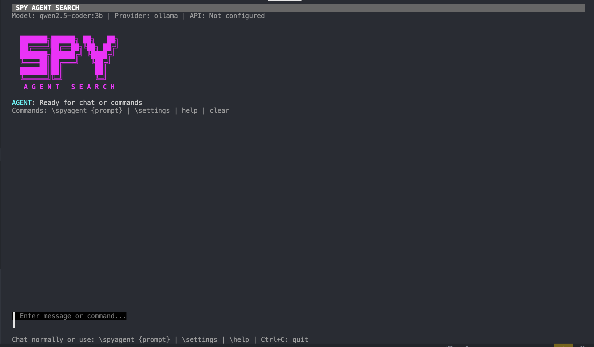

# Spy Search CLI

Spy Search CLI is our second open-source project, designed to outperform Gemini CLI. As you may have noticed, Gemini CLI has been running quite slowly.

At Spy Search, we prioritize speed and efficiency. We also believe in keeping our codebase open-source, allowing users to run it locally.

Like Gemini CLI, we don’t want to restrict users to specific IDEs like Cursor or Windsurf, as this could lead to higher costs in the future. Instead, we developed a CLI tool that can be used as long as you can type in a terminal. For example, I'm accustomed to the VS Code interface and prefer not to switch to Cursor. Spy Search CLI is the tool you need.

## Installation & Run 

To use the program you need go being installed. 

First run:
```bash
go get
```

Next you should run 
```bash
go run main.go
```

Then you would see the CLI. We suggest using 7b model for little task and not suggest using small model unless for testing purpose.

### Demo 


## Versions & Roadmap

Currently, we are in a rapid development phase, which means updates may vary greatly from day to day. However, here’s the general roadmap:

### News:
Spy search CLI v0.1 is finished ! 

### v0.1
- [x] Tool list
- [x] Agentic workflow
- [x] Basic CLI interface

### v0.2 
- [] multi-debate framework
- [] more tools: ckg , websearch
- [] more flexible working directory 

## Contribution

We welcome all types of contributions. However, please note that we are in a fast-paced development environment, and the code will evolve daily. If you're interested in collaborating, feel free to send me an email.